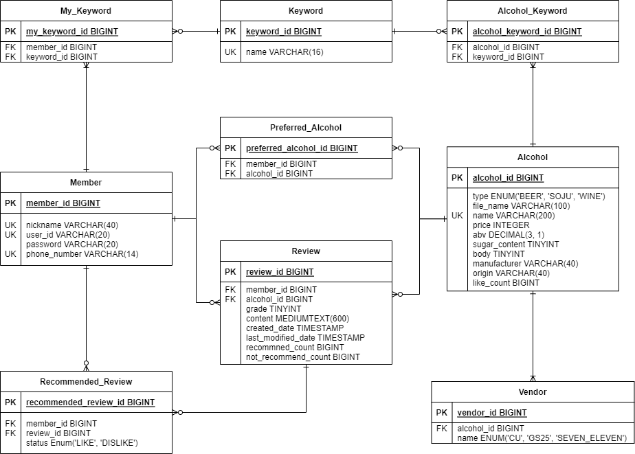

# 편술

## 1. 소개
 

    

- 편술은 편의점 술 정보 제공, 추천 및 검색 서비스입니다.
- [편술 링크](http://ec2-3-34-208-247.ap-northeast-2.compute.amazonaws.com:8080/)
 

 

## 2. 제작 기간 & 참여 인원
### 1) 프로젝트 설계 및 개발
  - 기간 : 2022.6.2 ~ 7.5
  - 인원 : [최준영](https://github.com/JunYoung-C), [장수빈](https://github.com/Jangsue), [신지환](https://github.com/sjihwan), [원연욱](https://github.com/wyu950)

### 2) 프로젝트 보완 및 배포
  - 기간 : 2022.7.6 ~ 7.21
  - 인원 : [최준영](https://github.com/JunYoung-C), [장수빈](https://github.com/Jangsue), [신지환](https://github.com/sjihwan)

 

## 3. 핵심 기능
- 편의점 술 정보 제공
  - 이름, 가격, 도수, 리뷰 평점, 판매 편의점, 제조사, 원산지, 키워드를 제공합니다.
    - 키워드란 술의 특징을 의미합니다. ex) `레드`, `청량함`, `도수 독함` 등
  - 관련 리뷰도 제공합니다.
- 술 추천 목록 제공
  - 좋아요 개수 또는 사용자가 선택한 키워드를 이용합니다.
- 술 검색 기능
  - 술 이름으로 검색합니다.
  - 키워드, 편의점, 정렬 조건을 동적으로 포함할 수 있습니다.

 

## 4. 기술 스택
### 1) Back-end

- Java 11
- Spring Boot 2.7.0
- Spring Data JPA
- QueryDsl
- Thymeleaf
- Gradle
- Junit5
- Mockito

### 2) DB

- MySQL 8.0.28
- H2

### 3) Infra

- AWS EC2
- AWS RDS

### 4) Front-end

- HTML
- CSS
- JavaScript

 

## 5. ERD 설계

